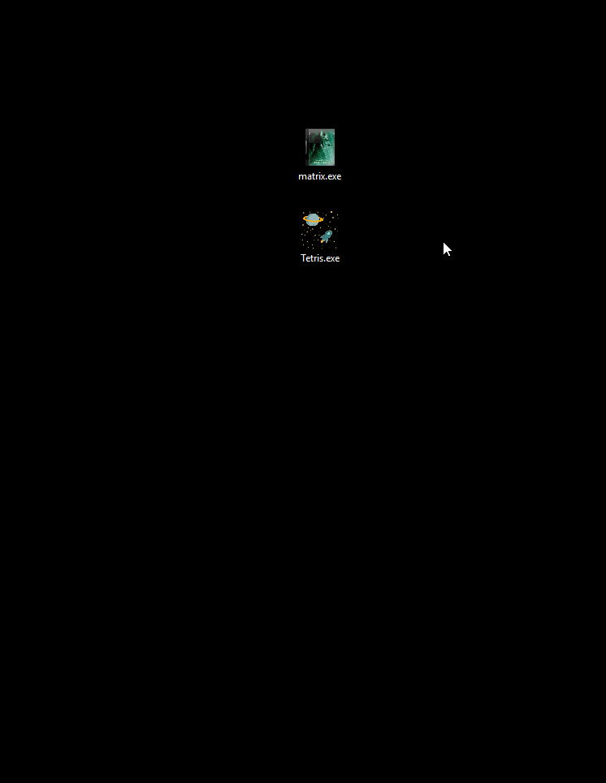

## Игра Tetris + создание exe-файла для Windows.

[Оригинальный код](https://github.com/CharlesPikachu/Games/tree/master/cpgames/modules/core/tetris)
игры был написан пользователем [CharlesPikachu](https://github.com/CharlesPikachu/Games) с
использованием библиотеки [PyQT5](https://doc.qt.io/qtforpython/index.html). 
 
Оригинальный код переписан для запуска без библиотеки PyQT5, средствами 
GUI Tkinter встроенной по умолчанию. Для создания exe-файла потребуется 
библиотека pyinstaller.



## Описание

Простая игра Тетрис. Создает в корне файл record, в который записываются 
максимально набранные очки. Если упаковать в exe-файл, то файл record 
создается в той же папке, где запущено приложение.
Для работы exe-файла будут созданы временные файлы, которые удалятся после 
закрытия приложения.

`WORK_PATH = getattr(sys, "_MEIPASS", os.path.abspath(os.path.dirname(__file__)))`

## Установка

### Скачать

Python3 должен быть уже установлен.
Скачать этот репозиторий себе на компьютер.

Рекомендуется использовать [virtualenv/venv](https://docs.python.org/3/library/venv.html)
для изоляции проекта.

#### Быстрая настройка venv

Начиная с Python версии 3.3, виртуальное окружение идёт в комплекте в виде модуля
venv. Чтобы его установить и активировать нужно выполнить следующие действия в
командной строке:  

Указать скачанный репозиторий в качестве каталога.
```sh
cd C:\Users\ваш_пользователь\Downloads\папка_репозитория
```
Установить виртуальное окружение в выбранном каталоге.
```sh
Python -m venv env
```
В репозитории появится папка виртуального окружения env  

<a href="https://imgbb.com/"></a>

Активировать виртуальное окружение.
```sh
env\scripts\activate
```
Если всё сделано правильно, вы увидите в командной строке (env) слева от пути 
каталога.  

<a href="https://imgbb.com/"></a>

#### Установить зависимости

Используйте `pip` (или `pip3`, есть конфликт с Python2) для установки 
зависимостей:

```sh
pip install -r requirements.txt
```

### Запуск

```sh
python tetris.py
```

### Создание exe-файла/запаковка

Чтобы просто создать exe-файл с настройками по умолчанию можно ввести команду:

```sh
pyinstaller tetris.py
```
Но так мы не добавим в наш exe-файл background, icon, iconbit, а также получится 
много файлов, по этому рассмотрим дополнительные аргументы:

`-w` - приложение будет запускаться без дополнительного окна консоли.  
`-F` - приложение будет собрано одним файлом.  
`-i` - добавить иконку приложения.  
`--add-data` - добавить дополнительный файл.

```sh
pyinstaller -w -F --add-data "asteroid.ico;." -i "space.ico" tetris.py
```

Приложение будет собрано одним файлом, будет запускаться без окна консоли, получит
иконку и иконку в окне состояния.  

Рассмотрим самый надежный способ создания exe-файла.

### Создание/редактирование файла .spec

Чтобы собрать приложение так, как необходимо, необходимо создать файл .spec, он также
создается сам при любом использовании pyinstaller.
Рассмотрим некоторые моменты на примере tetris.spec в репозитории:

Вначале указывается файл скрипта и путь к проекту, в параметре datas можно
указать необходимые файлы:

<a href="https://imgbb.com/"></a>

С помощью a.datas можно добавить много файлов, с обязательным указанием полного пути:

<a href="https://imgbb.com/"></a>

Можно указать имя приложения, иконку, запуск без консоли:

<a href="https://imgbb.com/"></a>

Теперь сборка exe-файла будет выглядеть так:

```sh
pyinstaller tetris.spec
```


## Цель проекта

Данный репозиторий создан с целью изучения создания игр на Python с GUI Tkinter 
и создания exe-файлов для Windows средствами Python.
